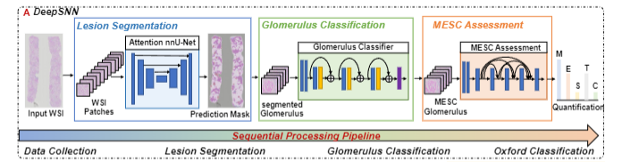

# A large-scale dataset and a deep sequential neural network for IgA nephropathy histopathology identification and quantification 
- This is the official repository of in our paper entitled "A large-scale dataset and a deep sequential neural network for IgA nephropathy histopathology identification and quantification".



## 1. Environment
    Python 3.8
    PyTorch = 2.0
    opencv-python

You can install them by the  [requirements.txt](https://github.com/fyb99/DeepSNN/blob/main/requirements.txt)
```bash
pip install -r requirements.txt
``` 


## 2. Dataset
The dataset can be downloaded from [Dropbox](https://www.dropbox.com/work/Shared/fyb/IgAN_WSI). Note we release the test set mentioned in the manuscript during the reviewing process. The training dataset will be available when the reviewing process is finished. If you are keen to download the whole dataset recently, you can send emails to pansai301@126.com.
 The email should contain your institution, your grade/occupation and the purpose of pursuing this dataset. The act of spreading our dataset freely on the Internet is forbidden.

## 3. Model
You can Download the pytorch model from [Dropbox](https://www.dropbox.com/work/Shared/fyb/IgAN_WSI) and put the .pth files in the repository folder.
## 4. Test
1. Clone this repository:
    ```
    https://github.com/fyb99/DeepSNN.git
    ```

2. Place the test images in `./data_test/img`, the annotation in `./data_test/gt`, the output of the lesion segmentation subnet in  `./data_test/nnunet_output`.
    ```
    data_test 
    └── img
    ├── gt
    ├── nnunet_output
    └── segcls
    ```

4. Run the following command in order for the IgA nephropathy histopathology identification task with the input whole slide image.
    ```
    python segcls_test.py  python MESTC_test.py
    ```

5. Finally, you can find the pixel-wise identification results in `./data_test/segcls` and the WSI-wise Oxford classification results in `./data_test/MESC_score.xlsx`..
## 5. Training
1. If you want to train the proposed method with our dataset or private dataset. Refer to [nnUNet](https://github.com/MIC-DKFZ/nnUNet) for training the lesion segmentation subnet. The source code of the proposed Attention nn-UNet is packed in `./nnunet`
2. Run the following command for training the glomerulus classification subnet.
    ```
    python vanilla_cls.py
    ```
3. Run the following command for training the MESC assessment subnet.
    ```
    python vanilla_MLC.py
    ```
   Note how the training sets of two subnets are generated can be found in `cls_dataset.py` and `MLC_dataset.py`.


